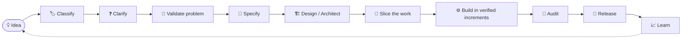

<div align="center">


# ⚡ VibeCoding-System

### A free, reusable engineering kit for building software with AI agents

**From a rough idea → to a specified, usable, accessible, tested, and supportable release.**

<br>

<a href="https://github.com/AshStarFall/VIBECODING-SYSTEM/stargazers"></a>
<a href="https://github.com/AshStarFall/VIBECODING-SYSTEM/network/members"></a>
<a href="https://github.com/AshStarFall/VIBECODING-SYSTEM/watchers"></a>
<a href="https://github.com/AshStarFall/VIBECODING-SYSTEM/blob/main/LICENSE"></a>
<a href="https://github.com/AshStarFall/VIBECODING-SYSTEM/commits/main"></a>

<br><br>


<br><br>

[🚀 Quick Start](#-quick-start) •
[🧭 Workflow](#-the-workflow) •
[💬 Kickoff Prompts](#-two-ways-to-kick-off) •
[🗺️ Navigate](#%EF%B8%8F-navigate-by-need) •
[📁 Repo Map](#-repository-map) •
[🤝 Contribute](#-contributing)

</div>

---

## ✨ What is this?

**VibeCoding-System** is an AI-native engineering playbook for turning a software idea into a tested, secure, maintainable release. It works as an **operating system for project work**: rules, workflows, role prompts, playbooks, quality gates, and templates that a coding agent (or a human) can follow from first idea to supportable release.

It is **not** a bundle of copied prompts or an unfiltered list of links.

> [!IMPORTANT]
> **Educational use:** This free kit is made for vibecoders and people learning to build software with AI. It provides general guidance and is not legal, security, or compliance advice. Read the full [disclaimer](DISCLAIMER.md).

---

## 🎯 Who this is for

| 👤 You are... | 💡 What you get |
| --- | --- |
| **A vibecoder or learner** building with AI assistants | A structure that prevents rework, insecure code, and unfinished products |
| **A solo builder or small team** | A lightweight, repeatable process with no heavy tooling |
| **Anyone directing a coding agent** | Consistent agent behavior: clarify first, plan, build in small verified steps, report honestly |

---

## 📦 What you get

| | |
| --- | --- |
| 🤖 **Agent operating rules** | Portable rules any coding agent can follow (`AGENTS.md`, `00-CORE/`) |
| 🔍 **Discovery and question frameworks** | Expose ambiguity before code is written |
| 📝 **Planning workflow and templates** | Requirements, architecture, and task slices |
| 🎭 **Role prompts and portable skills** | Repeatable tasks for agents |
| 🧱 **Stack playbooks** | Web, full-stack, mobile, desktop, and AI/LLM projects |
| 🎨 **Product design and experience audits** | Usability, likability, accessibility, and feedback |
| 🔐 **Security, quality, and release gates** | "Done" means verified, not assumed |
| 📚 **Curated resource index** | A selection standard for tools and references |
| 🔄 **Maintenance guidance** | Keeps this system current |

---

## 🧭 The workflow



The system optimizes for **useful outcomes, not code volume**. It requires evidence for important claims, explicit assumptions, small reversible changes, and validation against the running product where possible. It does not require every project to use every tool or phase at maximum depth.

---

## 💬 Two ways to kick off

Pick the path that matches where you are working.

| | 🅰️ Agent with repo access | 🅱️ AI chat (no file access) |
| --- | --- | --- |
| **Use in** | Cursor, Claude Code, Windsurf, Copilot agent mode, and similar tools | ChatGPT, Claude.ai, Gemini, or any chat app |
| **What happens** | The agent reads this system and creates project files **inside your repo** | The AI interviews you, then generates a **file pack you download and copy** into your project |
| **Best when** | You already have a project folder open | You are still shaping your idea, or your tool has no file access |

### 🅰️ Kickoff prompt: coding agent with repository access

Give your coding agent your project idea and this repository URL. It should read [`AGENTS.md`](AGENTS.md), then follow [`00-CORE/VIBECODING-PROTOCOL.md`](00-CORE/VIBECODING-PROTOCOL.md). It should classify the project, load only relevant playbooks, ask high-impact questions, create project specifications, and wait for approval before implementation when scope is material.

<details open>
<summary><strong>📋 Copy-ready kickoff prompt (agent)</strong></summary>

```text
I want to build: <your idea>
Use https://github.com/AshStarFall/VIBECODING-SYSTEM as the engineering system.
Read AGENTS.md and follow 00-CORE/VIBECODING-PROTOCOL.md. Inspect my project
repository and local instructions. First classify the project, load only relevant
guidance, ask questions that could change scope or safety, and draft project-specific
requirements, technical plan, and task slices. Show me the files and wait for approval
before substantial implementation. Build in small, verified increments and report
actual checks and remaining risks.
```

</details>

### 🅱️ Kickoff prompt: AI chat that builds your downloadable file pack

Use this when you want to **describe your idea and plans in a normal chat**, and have the AI use this repository to produce the project files for you. You then download or copy them into your project and open it in Cursor, Claude Code, Windsurf, or any other agentic coding app.

<details open>
<summary><strong>📋 Copy-ready kickoff prompt (AI chat → file pack)</strong></summary>

```text
You are my vibecoding project architect. Use the engineering system at
https://github.com/AshStarFall/VIBECODING-SYSTEM to prepare the project files I will
hand to an agentic coding app (Cursor, Claude Code, Windsurf, GitHub Copilot, or similar).

STEP 0 - Load the system
Read AGENTS.md and 00-CORE/VIBECODING-PROTOCOL.md from that repository, then load only
the playbooks that fit my project (01-DISCOVERY, 04-PLANNING, 07-STACK-PLAYBOOKS,
08-PRODUCT-DESIGN, 09-SECURITY, 10-QUALITY, 11-DELIVERY, 13-TEMPLATES).
If you cannot open the repository, tell me and ask me to paste AGENTS.md. Do not guess
its contents.

MY PROJECT
Idea: <describe what you want to build>
Who it is for: <users / audience>
Plans, features, and constraints: <platform, budget, deadline, must-haves, preferred
tools, anything that matters>
Tools I will build with: <Cursor / Claude Code / Windsurf / Copilot / other>

STEP 1 - Classify and clarify
Classify the project type. Then ask me only the high-impact questions that could change
scope, safety, security, privacy, accessibility, or cost. Ask in small batches and wait
for my answers. Label everything as requirement, decision, assumption, or open question.

STEP 2 - Draft and get approval
Draft the project-specific requirements, technical plan, and task slices (smallest
complete vertical slice first), following the templates in 13-TEMPLATES. Show me the
draft and wait for my approval before generating the final pack.

STEP 3 - Generate the file pack
After I approve, output each file in its own code block with its exact path as a
heading, ready to copy or download. If you can create downloadable files or a .zip,
do that too. Include:
- AGENTS.md (project-specific operating rules; the single source of truth)
- docs/PROJECT-BRIEF.md
- docs/REQUIREMENTS.md
- docs/ARCHITECTURE.md
- docs/TASKS.md (ordered slices with acceptance checks)
- docs/SECURITY-AND-QUALITY-CHECKLIST.md
- docs/EXPERIENCE-AUDIT.md (usability and accessibility checks)
- Tool adapter files for the tools I named, each short and pointing back to AGENTS.md
  rather than duplicating it:
  - Claude Code: CLAUDE.md
  - Cursor: .cursor/rules/project.mdc
  - Windsurf: .windsurf/rules/project.md
  - GitHub Copilot: .github/copilot-instructions.md
Check each tool's current documentation for the correct file location and format before
writing its adapter file, and tell me if anything may be out of date.

STEP 4 - Hand-off instructions
End with a short checklist: where to save each file in my project, and the exact first
message to paste into my coding app to start Slice 1.

RULES
- Keep files concise. Do not invent facts, versions, or tools; mark unknowns as open
  questions.
- Never include secrets, API keys, or tokens in any file.
- Do not copy third-party prompts or documentation wholesale.
- Report honestly what you verified and what you could not.
```

</details>

> [!TIP]
> **Best results in chat:** use an AI that can browse GitHub, and answer the clarifying questions honestly. If the AI cannot open the repo, paste `AGENTS.md` and `00-CORE/VIBECODING-PROTOCOL.md` into the chat first.

> [!NOTE]
> An AI with repository access can create project-specific files in your project repo. A chat without file access can draft their contents for you to save yourself. This kit does not automatically install frameworks or guarantee a professional outcome.

---

## 🚀 Quick start

<details open>
<summary><strong>Path A: I already have a project folder open in an agentic app</strong></summary>

1. Open your project in **Cursor, Claude Code, Windsurf**, or a similar tool.
2. Paste the **🅰️ agent kickoff prompt** with your idea filled in.
3. Answer the agent's clarifying questions.
4. Review the generated requirements, technical plan, and task slices. Approve or change them.
5. Let the agent build in small increments. Check its reported tests and remaining risks after each slice.

</details>

<details>
<summary><strong>Path B: I only have an idea and want to plan it in a chat first</strong></summary>

1. Open any AI chat and paste the **🅱️ chat kickoff prompt** with your idea and plans filled in.
2. Answer the clarifying questions and approve the draft.
3. Download or copy the generated file pack.
4. Create your project folder and save the files at the paths the AI gave you.
5. Open the folder in Cursor, Claude Code, Windsurf, or another agentic app and paste the first message the AI provided.

</details>

<details>
<summary><strong>What the generated pack typically looks like</strong></summary>

```text
your-project/
├── AGENTS.md                          # single source of truth for agent rules
├── CLAUDE.md                          # Claude Code adapter -> points to AGENTS.md
├── .cursor/rules/project.mdc          # Cursor adapter
├── .windsurf/rules/project.md         # Windsurf adapter
├── .github/copilot-instructions.md    # GitHub Copilot adapter
└── docs/
    ├── PROJECT-BRIEF.md
    ├── REQUIREMENTS.md
    ├── ARCHITECTURE.md
    ├── TASKS.md
    ├── SECURITY-AND-QUALITY-CHECKLIST.md
    └── EXPERIENCE-AUDIT.md
```

Tool file locations and formats change over time. Confirm them in each tool's documentation.

</details>

---

## 🗺️ Navigate by need

| 🎯 Need | 📖 Start with |
| --- | --- |
| Give an agent durable operating rules | [`AGENTS.md`](AGENTS.md), [`00-CORE/SYSTEM-RULES.md`](00-CORE/SYSTEM-RULES.md) |
| Triage an idea and decide what to load | [`01-DISCOVERY/PROJECT-TRIAGE.md`](01-DISCOVERY/PROJECT-TRIAGE.md) |
| Ask better questions and expose ambiguity | [`01-DISCOVERY/QUESTION-FRAMEWORK.md`](01-DISCOVERY/QUESTION-FRAMEWORK.md) |
| Keep project memory and decisions organized | [`02-MEMORY/`](02-MEMORY/) |
| Keep context and token use lean | [`03-CONTEXT/CONTEXT-POLICY.md`](03-CONTEXT/CONTEXT-POLICY.md) |
| Write requirements and architecture | [`04-PLANNING/PLANNING-WORKFLOW.md`](04-PLANNING/PLANNING-WORKFLOW.md), [`13-TEMPLATES/`](13-TEMPLATES/) |
| Use role prompts or repeatable skills | [`05-AGENTS/`](05-AGENTS/), [`06-SKILLS/`](06-SKILLS/) |
| Choose platform-specific guidance | [`07-STACK-PLAYBOOKS/README.md`](07-STACK-PLAYBOOKS/README.md) |
| Audit experience, likability, usability, accessibility, and feedback | [`08-PRODUCT-DESIGN/EXPERIENCE-AUDIT.md`](08-PRODUCT-DESIGN/EXPERIENCE-AUDIT.md), [`13-TEMPLATES/EXPERIENCE-AUDIT.md`](13-TEMPLATES/EXPERIENCE-AUDIT.md) |
| Address security, testing, and release readiness | [`09-SECURITY/SECURITY-GATES.md`](09-SECURITY/SECURITY-GATES.md), [`10-QUALITY/QUALITY-GATES.md`](10-QUALITY/QUALITY-GATES.md), [`11-DELIVERY/RELEASE-PLAYBOOK.md`](11-DELIVERY/RELEASE-PLAYBOOK.md) |
| Find and evaluate a tool or reference | [`12-RESOURCES/README.md`](12-RESOURCES/README.md) |
| Keep this system current | [`14-MAINTENANCE/RESOURCE-REVIEW.md`](14-MAINTENANCE/RESOURCE-REVIEW.md) |

---

## 🧩 Project types covered

🌐 Websites and web apps &nbsp;•&nbsp; 🖥️ Full-stack services &nbsp;•&nbsp; 📱 Android/mobile apps &nbsp;•&nbsp; 🪟 Desktop apps &nbsp;•&nbsp; 🧠 AI/LLM products &nbsp;•&nbsp; 🗄️ Data-backed applications &nbsp;•&nbsp; ➕ Other software

Load only applicable platform guidance. The stack defaults in a playbook are suggestions, never requirements.

---

## 🧠 Design principles

- 🎯 **Discover first.** Understand the user, real problem, desired outcome, and constraints before selecting a stack.
- 🧾 **Keep things labeled.** Separate requirements, decisions, assumptions, and open questions.
- 🍰 **Think small.** Prefer the smallest complete vertical slice; build schema and contracts before dependent layers.
- 🔐 **Design in the hard stuff.** Security, privacy, accessibility, and operations are design concerns, not end-of-project decorations.
- ✅ **Verify.** Use tests and live behavior to check claims; report what was and was not checked.
- 🧰 **Pick tools deliberately.** Choose by fit, risk, maintenance, setup cost, and context cost, not to look sophisticated.
- ⚖️ **Respect licenses.** Never copy third-party prompts, skills, code, screenshots, or documentation wholesale without permission and license review.

---

## 📁 Repository map

| 📂 Path | 🎯 Purpose |
| --- | --- |
| `AGENTS.md` | Canonical, portable entrypoint for coding agents |
| `00-CORE` | System rules, agent context, and lifecycle protocol |
| `01-DISCOVERY` | Project triage, intake, and question framework |
| `02-MEMORY` | Durable project memory, decisions, and assumptions |
| `03-CONTEXT` | Context and token-use policy |
| `04-PLANNING` | Requirements, specifications, architecture, and task slicing |
| `05-AGENTS` | Copy-ready role prompts |
| `06-SKILLS` | Portable, repeatable task workflows |
| `07-STACK-PLAYBOOKS` | Platform and stack-specific guidance |
| `08-PRODUCT-DESIGN` | Product design and experience audits |
| `09-SECURITY` | Security gates and practices |
| `10-QUALITY` | Testing and quality gates |
| `11-DELIVERY` | Release and operations playbooks |
| `12-RESOURCES` | Deduplicated discovery index and resource-card standard |
| `13-TEMPLATES` | Project artifacts to copy into a new project |
| `14-MAINTENANCE` | Keeping this system and its recommendations current |
| `assets` | Logo and other repository media |
| `data` | Supporting data files, such as aggregate traffic data for the repository badge |
| `scripts` | Helper scripts used by repository automation |
| `.github/workflows` | GitHub Actions workflows, including the daily traffic snapshot |
| `CONTRIBUTING.md`, `DISCLAIMER.md`, `SECURITY.md`, `LICENSE` | Contribution, educational-use, security, and license information |

---

## 🔌 Use with any coding agent

`AGENTS.md` is the canonical portable entrypoint. For systems that support project instructions, skills, rules, or slash commands (such as Cursor rules, `CLAUDE.md`, or Windsurf rules), adapt these documents to that system and **keep a single source of truth**. Do not assume a skill is installed just because this repository links to it.

---

## 📚 Resource handling

The resource catalog consolidates repeated entries and records selection guidance rather than mirroring external repositories. Links are discovery leads, not endorsements or current compatibility guarantees. Verify activity, official documentation, security posture, license, pricing, and platform fit before adoption. No third-party source content or screenshot archive is redistributed here.

---

## 🤝 Contributing

See [`CONTRIBUTING.md`](CONTRIBUTING.md). Keep guidance concise, tool-neutral where possible, and linked to a decision or quality outcome. See [`14-MAINTENANCE/RESOURCE-REVIEW.md`](14-MAINTENANCE/RESOURCE-REVIEW.md) before adding or refreshing references.

---

## 📊 Usage and project activity

The badges above show public GitHub signals: stars, forks, watchers, license, and latest commit. They are not counts of people who installed the kit or used it in an AI conversation.

<details>
<summary><strong>Optional: cumulative page-view counter (maintainers)</strong></summary>

This repository includes an optional [traffic workflow](.github/workflows/repo-traffic.yml) that keeps a cumulative count of repository page views. GitHub only exposes the latest 14 days of traffic, so history that expired before the workflow first ran cannot be recovered, and the total is marked as partial in that case. The count measures page-view events, not distinct people, installs, or AI-kit usage.

To enable it, create a fine-grained token limited to this repository with **Administration: read**, then save it under **Settings → Secrets and variables → Actions** as `REPO_TRAFFIC_TOKEN`. The workflow uses that secret only to read GitHub's aggregate traffic API. A separate `GITHUB_TOKEN` publishes the aggregate JSON badge data. GitHub can delay scheduled runs. **Never put the token in a file or prompt.** Maintainers can also inspect GitHub → Insights → Traffic directly.

</details>

---

## 🔒 License and security

Original materials in this repository are offered under the [MIT License](LICENSE). External projects and linked materials retain their own licenses and terms. See [DISCLAIMER.md](DISCLAIMER.md) for educational-use limits and [SECURITY.md](SECURITY.md) for private vulnerability reporting guidance.

<div align="center">

<br>

**Built for people who build with AI.** ⚡ If this kit helps you, consider giving it a ⭐

</div>