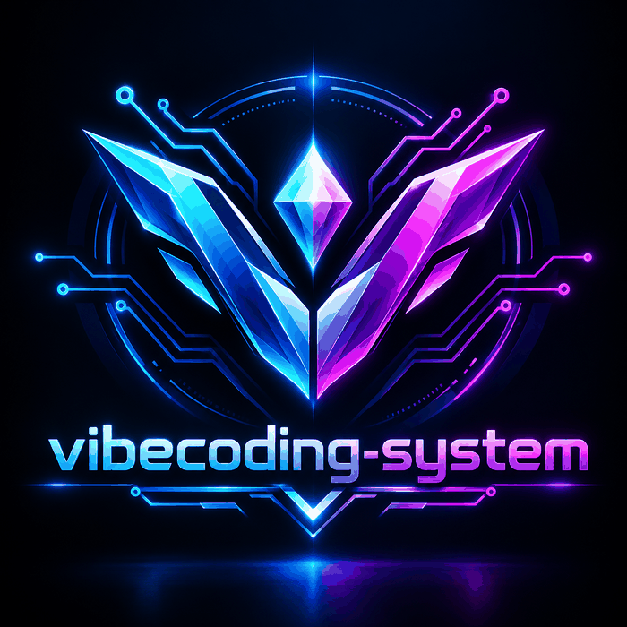

<div align="center">
     
     <h1>VibeCoding-System</h1>
     <p><strong>A free, reusable engineering kit for building software with AI agents.</strong></p>
     <p>From a rough idea to a specified, usable, accessible, tested, and supportable release.</p>
     <p>
          <a href="https://github.com/AshStarFall/VIBECODING-SYSTEM/stargazers"></a>
          <a href="https://github.com/AshStarFall/VIBECODING-SYSTEM/network/members"></a>
          <a href="https://github.com/AshStarFall/VIBECODING-SYSTEM/watchers"></a>
          <a href="https://github.com/AshStarFall/VIBECODING-SYSTEM/blob/main/LICENSE"></a>
          <a href="https://github.com/AshStarFall/VIBECODING-SYSTEM/commits/main"></a>
     </p>
</div>

---

An AI-native engineering playbook for turning a software idea into a tested, secure, maintainable release. It is an operating system for project work, not a bundle of copied prompts or an unfiltered list of links.

> **Educational use:** This free kit is made for vibecoders and people learning to build software with AI. It provides general guidance and is not legal, security, or compliance advice. Read the full [disclaimer](DISCLAIMER.md).

## Start here

Give your coding agent your project idea and this repository URL. Ask it to read [`AGENTS.md`](AGENTS.md), then follow [`00-CORE/VIBECODING-PROTOCOL.md`](00-CORE/VIBECODING-PROTOCOL.md). The agent should classify the project, load only relevant playbooks, ask high-impact questions, create project specifications, and wait for approval before implementation when scope is material.

<details open>
<summary><strong>Copy-ready kickoff prompt</strong></summary>

```text
I want to build: <your idea>
Use https://github.com/AshStarFall/VIBECODING-SYSTEM as the engineering system.
Read AGENTS.md and follow 00-CORE/VIBECODING-PROTOCOL.md. Inspect my project
repository and local instructions. First classify the project, load only relevant
guidance, ask questions that could change scope or safety, and draft project-specific
requirements, technical plan, and task slices. Show me the files and wait for approval
before substantial implementation. Build in small, verified increments and report
actual checks and remaining risks.
```

</details>

> An AI with repository access can create project-specific files in your project repo. A chat without file access can draft their contents. This kit does not automatically install frameworks or guarantee a professional outcome.

## The workflow

```text
Idea -> classify -> clarify -> validate the problem -> specify -> design/architect
     -> slice the work -> implement in verified increments -> audit -> release -> learn
```

The system optimizes for useful outcomes, not code volume. It requires evidence for important claims, explicit assumptions, small reversible changes, and validation against the running product where possible. It does not require every project to use every tool or phase at maximum depth.

## Navigate by need

| Need | Start with |
| --- | --- |
| Give an agent durable operating rules | [`AGENTS.md`](AGENTS.md), [`00-CORE/SYSTEM-RULES.md`](00-CORE/SYSTEM-RULES.md) |
| Triage an idea and decide what to load | [`01-DISCOVERY/PROJECT-TRIAGE.md`](01-DISCOVERY/PROJECT-TRIAGE.md) |
| Ask better questions and expose ambiguity | [`01-DISCOVERY/QUESTION-FRAMEWORK.md`](01-DISCOVERY/QUESTION-FRAMEWORK.md) |
| Keep context and token use lean | [`03-CONTEXT/CONTEXT-POLICY.md`](03-CONTEXT/CONTEXT-POLICY.md) |
| Write requirements and architecture | [`04-PLANNING/PLANNING-WORKFLOW.md`](04-PLANNING/PLANNING-WORKFLOW.md), [`13-TEMPLATES/`](13-TEMPLATES/) |
| Use role prompts or repeatable skills | [`05-AGENTS/`](05-AGENTS/), [`06-SKILLS/`](06-SKILLS/) |
| Choose platform-specific guidance | [`07-STACK-PLAYBOOKS/README.md`](07-STACK-PLAYBOOKS/README.md) |
| Audit user experience, likability, usability, accessibility, and feedback | [`08-PRODUCT-DESIGN/EXPERIENCE-AUDIT.md`](08-PRODUCT-DESIGN/EXPERIENCE-AUDIT.md), [`13-TEMPLATES/EXPERIENCE-AUDIT.md`](13-TEMPLATES/EXPERIENCE-AUDIT.md) |
| Address security, testing, and release readiness | [`09-SECURITY/SECURITY-GATES.md`](09-SECURITY/SECURITY-GATES.md), [`10-QUALITY/QUALITY-GATES.md`](10-QUALITY/QUALITY-GATES.md), [`11-DELIVERY/RELEASE-PLAYBOOK.md`](11-DELIVERY/RELEASE-PLAYBOOK.md) |
| Find and evaluate a tool/reference | [`12-RESOURCES/README.md`](12-RESOURCES/README.md) |

## Project types covered

Websites and web apps, full-stack services, Android/mobile apps, desktop apps, AI/LLM products, data-backed applications, and other software. Load only applicable platform guidance. The stack defaults in a playbook are suggestions, never requirements.

## Design principles

- Discover the user, real problem, desired outcome, and constraints before selecting a stack.
- Keep an explicit distinction between requirements, decisions, assumptions, and open questions.
- Prefer the smallest complete vertical slice; build schema/contracts before dependent layers.
- Treat security, privacy, accessibility, and operations as design concerns, not end-of-project decorations.
- Use tests and live behavior to verify claims; report what was and was not checked.
- Select tools by fit, risk, maintenance, setup cost, and context cost. Do not add tools to look sophisticated.
- Never copy third-party prompts, skills, code, screenshots, or documentation wholesale without permission and license review.

## Repository map

- `00-CORE`: system rules, agent context, and lifecycle protocol.
- `01-DISCOVERY` to `04-PLANNING`: intake, requirements, context use, specifications, and architecture.
- `05-AGENTS` and `06-SKILLS`: copy-ready role prompts and portable task workflows.
- `07-STACK-PLAYBOOKS` to `11-DELIVERY`: platform, product/design and experience audits, security, quality, and operations.
- `12-RESOURCES`: deduplicated discovery index and resource-card standard.
- `13-TEMPLATES`: project artifacts to copy into a new project.
- `14-MAINTENANCE`: keep this system and its recommendations current.

## Resource handling

The catalog combines resources supplied in `REPOS.txt` and `Resorce.txt`, consolidates repeated entries, and adds broad categories identified in the notes. It records selection guidance rather than mirroring external repositories. Links are discovery leads, not endorsements or current compatibility guarantees. Verify activity, official documentation, security posture, license, pricing, and platform fit before adoption. No supplied screenshot archive or third-party source content is redistributed here.

## Use with any coding agent

`AGENTS.md` is the canonical portable entrypoint. For systems that support project instructions, skills, or slash commands, adapt these documents to that system and keep a single source of truth. Do not assume that a skill is installed just because this repository links to it.

## Contributing

See [`CONTRIBUTING.md`](CONTRIBUTING.md). Keep guidance concise, tool-neutral where possible, and linked to a decision or quality outcome. See [`14-MAINTENANCE/RESOURCE-REVIEW.md`](14-MAINTENANCE/RESOURCE-REVIEW.md) before adding or refreshing references.

## Usage and project activity

The badges above show public GitHub signals: stars, forks, watchers, license, and latest commit. They are not counts of people who installed the kit or used it in an AI conversation.

Maintainers can see recent page views and clone activity in **GitHub → Insights → Traffic**. GitHub exposes this traffic to repository owners and collaborators, not as a public lifetime usage counter. This repository does not add a third-party visitor tracker or claim an unmeasured user count.

## License and security

Original materials in this repository are offered under the [MIT License](LICENSE). External projects and linked materials retain their own licenses and terms. See [DISCLAIMER.md](DISCLAIMER.md) for educational-use limits and [SECURITY.md](SECURITY.md) for private vulnerability reporting guidance.